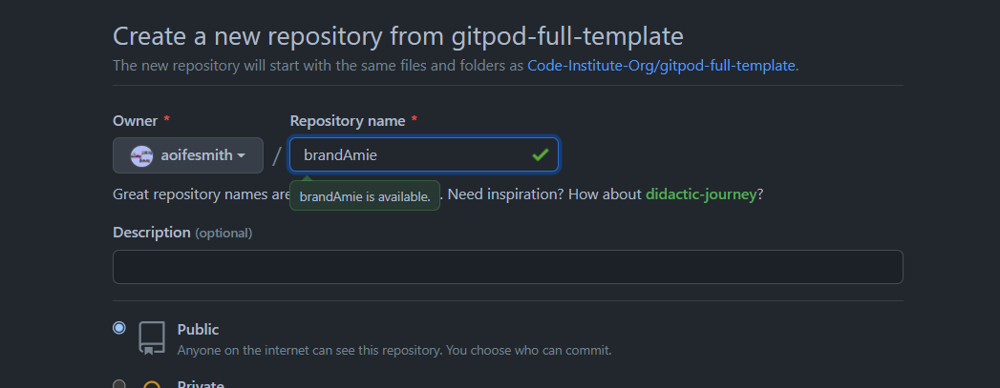

# brandAmi Ambassador Eligibility Checker
By: [Aoife, Smith](mailto:aoifesmithy@hotmail.com), November 2021 
This website has been created as a second portfolio for the Code Institute's Full Stack Software Development Course. This is a fictitious site. The site is a brand ambassador service that is expanding its community of brand ambassadors for its clients and products it is aligned with. 'Ami' is the French translation of 'friend'. The live website can be found [here](https://aoifesmith.github.io/brandAmi)

# User Experience Design

# The Strategy Plane
The site should be intuitive to use. The site provides users with an eligibility checker form created using JavaScript, HTML & CSS. The eligibility checker should be easy to understand, simple to interactive with and give feedback to the user on inputs.

## Purpose
The site’s purpose is to check eligibility of candidates/applicants who want to apply to become an ambassador. The site provides information to create awareness of the company and its services. It provides an application form for a user to fill out which determines if an applicant meets the eligibility criteria to become a brand ambassador. It processes user input information carrying out defensive programming techniques with validation checks on user input in order. If they do not meet criteria they will be unsuccessful in their application. The benefit of the app is to save time on a screening process not allowing a user to proceed with application if they do not meet requirements. Inclusion of defensive programming reduces human error and other risks by anticipating them and designing them out. A video tutorial is included on the site with instructions on how to apply and the eligibility criteria to be met to be a successful applicant. Information about the company, useful links and social profiles are provided for the user to create awareness of the company.

## How does it work?
The website provides an application form which determines eligibility of applicant to become a brand ambassador with brandAmi. The user inputs their data during the application process. The site responds to the users' actions, allowing users to actively engage with data, and alter the way the site displays the information to achieve their preferred goals.

## Site Goals:

### External User Goals:
* The site users want to find out about the services of the company brandAmi. 
* An applicant wants to apply to become a brand ambassador with brandAmi.

### Site Owner Goals:
* To provide users with an eligibility checker to see if they qualify to become a brand ambassador within the brandAmi community.
* To attain valid user information using defensive programming and ensure applicant can proceed with steps only after passing expected criteria.
* Provide user instructions on how to use the application checker and confirm criteria needed to be a successful applicant. 

### User stories
1. As a user, I want to easily understand the main purpose of the site.
2. As a user, I want to view the website and content clearly on any device.
3. As a user, I want to have instructions on how use the eligibility checker so that I can easily understand the process and requirements.
4. As a user, I want to learn what the eligibility requirements are to become a brand ambassador so I can ensure I meet criteria to become a successful applicant.
5. As a user, I want to be alerted to any errors I make during my application process.
6. As a user, I want to be advised if I have been successful in my application so I will be informed as to whether I need to reapply or wait upon instruction as a confirmed candidate..
7. As a user, I want to be offered the opportunity to reset the application process. 
8. As a user, I want to be provided with contact information for the site owner in case I want to reach out with any queries I have about the site.
9. As a site owner I want to be able to provide users a brief overview of the company so users can be informed what the company does.

# The Scope Plane

## Features planned:
* Header area with Navigation.
* Hero image with information about the site.
* Video of how to use the site.
* Application Instructions - Clear instructions on how to traverse the application.
* Apply Button.
* Incorrect user input displayed.
* Message advising where ineligible criteria selected.
* Footer Items - Contact Information and links to social media profiles.

# The Structure Plane

## User Story 1:
*As a user, I want to easily understand the main purpose of the site.*
### Acceptance Criteria:
* Provide ‘About’ heading with text content explaining the services of the business.
### Description:
There will be a section on the home page that gives text based information about the services of the business and what these entail. This will enable the users to immediately see what the site is about as soon as they arrive on the landing home page. 

## User Story 2:
*As a user, I want to view the website and content clearly on any device.*
### Acceptance Criteria:
* Website layout is well displayed and readable across all sized devices.
### Description:
Flexbox is implemented to lay the content of the Website out in containers, rows and columns. Media queries are used to layout the content of the website and work across a variety of devices from desktop to tablet to mobile.

## User Story 3:
*As a user, I want to have instructions on how to use the eligibility checker so that I can easily understand the process and requirements.*
### Acceptance Criteria:
* How to Apply Instructions are provided that contain the following information:
* 	How to use the eligibility checker.
* 	How to be successful in applying to become a brandAmi ambassador.
* 	How to be unsuccessful in applying to become an ambassador.
### Description:
Information to be included: A set of instructions will be added below the application form. This will display to the user, information on how to input manual data inputs, what inputs are accepted, how to be successful or unsuccessful in the application process.
Incorrect user data text input will be shown below the ‘Apply Now’ header so that the user can see what data they have either missed filling in or input.
If the user is successful in inputting their user id and password correctly they will
Only numbers will be accepted as the user id which is a 4 digit number.
The password cannot be the word ‘password’ and must be between 6 and 20 characters combined. 

## User Story 4:
*As a user, I want to learn what the eligibility requirements are to become a brand ambassador so I can ensure I meet criteria to become a successful applicant.*
### Acceptance Criteria:
* A list of requirements to be provided in the Critera section on main page as well as the 'How to Apply' modal button which contain a list of requirements
### Description:
Information to be included: A list of eligibility requirements that are required to become a successful candidate. 
You need to be a resident of Ireland.
You must be over 18 years of age.
You must have at least 5k IG followers.
You must have at least 20k TikTok followers.
A sinister plot twist with ties to selling ones soul of course.

## User Story 5:
*As a user, I want to be alerted to any errors I make during my application process.*
### Acceptance Criteria:
* Unsuccessful data input errors are displayed on form area.
### Description:
If the user enters an unsuccessful input for the user id or password, an error will be displayed in the form area under the 'Apply' heading. It will be highlighted with a different colour background which draws the user attention to the information required. 

## User Story 6:
*As a user, I want to be advised if I have been successful in my application so I will be informed as to whether I need to reapply or wait upon instruction as a confirmed candidate.*
### Acceptance Criteria:
* Successful completion of the application displayed to user.
### Description:
If the user successfully answers the eligibility criteria a message will be displayed that the user is a successful candidate and will be contacted in due course. If the user is unsuccessful in a question they will not be able to proceed with further queries and will be prompted that they are ineligibe to become a brandAmi ambassador. 

## User Story 7:
*As a user, I want to be offered the opportunity to reset the application process mid process*
### Acceptance Criteria:
* Reset feature provided in the eligibility application area.
### Description:
If the user wants to return to the initial eligibility checker questions they can opt to click on the reset feature and reset the questions. 

## User Story 8:
*As a user, I want to be provided with contact information for the site owner in case I want to reach out with any queries I have about the site.*
### Acceptance Criteria:
* Contact Information displayed in footer.
### Description:
Contact information will be added to the footer. This will contain a name and email for the site owner.

## User Story 9:
* As a site owner I want to be able to provide users a brief overview of the company so users can be informed what the company does*
### Acceptance Criteria:
* Company services info displayed in the About opening paragraph on main page. 
### Description:
Company information advising it's services will be added to the opening paragraph of the main page. The information will include details about who the service is for. 

# The Skeleton Plane
## Wireframes
Wireframes were originally hand sketched designs created to aid planning the website layout. These were then created using Balsamiq. 
* Mobile, Tablet, and Desktop wireframes are all available [here.](documentation/wireframes/ba-wireframes-all.pdf) with index.html images below and eligible.html with 404.html to follow in the dropdown menu.

<u>SEE IMAGES Wireframes  Layout Images</u>

 

# The Surface Plane
## **Design**
## Imagery
The logo is a simple yellow design with the company name and an icon that combines the letters 'b' and 'a'. It is a custom created design made using the ios Procreate app. A variety of options was created and included square, vertical, horizontal sizes with and without transparent backgrounds. From Pixabay to Unsplash, research was conducted on a number of free photography websites. As the research progressed, the concept of using illustrations instead became a was deemed more appropriate as they are modern and contemporary and could cater to a wide range of people through the usage of diverse colors. Undraw provided the illustrations that were finally approved for usage.

The 'About' section's hero picture is a simple representation of a person with a number of computer devices behind them. Because social media is at the forefront of it, having an illustration with the devices was thought acceptable to the services of the business. To ensure uniformity & consistency across the site, the image was carefully altered to use the same hex color as the brand logo.

In order to amplify this consistency in the look and feel of the website all images were then altered using the colour scheme settled on for the site. The images were compressed using the site tinypng to help improve site loading time performance and prevent user delay wait times. When tinypng was not implemented images that were sent from the developer’s iPad through the mail app selected either the small or medium size selection keeping kbs sizes as low as possible without losing integrity of the image or pixilation issues.

## Colour Scheme
The colour scheme was inspired by the name of the business. As this is a fictitious site a number of business names were considered. Given the nature of the site was for brand ambassadors the name ‘Ami’ was considered. It is the French translation of friend. brandAmi was the final outcome. With the word ‘friend’ in mind research on colours began. Yellow is the colour associated with friendship. Positive, sunny and optimistic, yellow is energetic and eye-catching – and particularly effective for point-of-sale messaging, as it's proven to catch the eye quicker than any other colour. From this the colour scheme evolved. Colours including various shades of yellow, blue and grey were run through a number of different colour generators (Brandfolder, Coolors, Procreate) until finally settling upon. Image Color Testing Report 

These were then tested for contrast ratios in order to ensure they would pass accessibility requirements. By ensuring this step was carried out the result would be to the benefit of those with visual impairments. Where it was deemed necessary to slightly alter the colour value to achieve higher accessibility ratio results amendments were then made. These were only done whereby the integrity of the design was to be maintained. See Color Contrast Test Report.

## Typography
Research was carried out on a number of fonts for the website. An important consideration was in the area of accessibility. Given the modern and contemporary business approach the decision was to use a clear san-serif font. The site is to appeal to a wide variety of users and so keeping the typography in an easily readable font was of significant importance. A number of tests and comparisons were carried out matching various suitable fonts and seeing how they looked compared against each other. The fonts were rotated to see what differences were when swapped from header to paragraph text. 

Sometimes one font is enough to make your design stand. This is one of those times. The final confirmed fonts is Quicksand was selected whereby it would use two different weights. ‘Medium’ for the headings and ‘Light’ for the body. Quicksand is a geometric display sans-serif with rounded terminals, which makes it a friendly and pleasant type. Using it with bright colors creates a modern and sharp look. A backup font of sans-serif would be used where these fonts were not available so the site would still remain relatively consistent.

## Favicon

A favicon was created on the [Favicon.io](https://favicon.io/) website using the custom created logo. The logo was cropped to only include the icon of the merged 'b' & 'a. The colour yellow #ffce24 is the primary colour used. The background colour is transparent in this image. The text and colours were selected for consistency across the site. Care was taken to ensure the simple icon ‘ba’ for the site business name. The beneficial use of the favicon is it helps the user save time and quickly identify your website without difficulties. It follows a goal of making the site intuitive for navigation both internally and externally when multiple tabs are open. It also reinforces the ‘brand’ of the website and gives a sense of confirmation that the user is on the right site.

## Differences to Design
All features listed in the Structure Plane were implemented as per design. A custom 404 page was added to the website that contains an link to allow the user to direct back to the home page if they try to access a page that is not available.

# Features
## **Existing Features**
All pages have a header and footer. 

## Header
The header contains the logo and the menu navigation links. This is located at the top of every page. 

* ### Logo
    The logo is an interactive feature that directs the user to the home page. It is a simple text design with the website business name brandAmi.
* ### Nav Bar 
    The nav bar contains the links to the various pages or anchor tags on the website. The logo has a deep yellow colour whereas the rest of the bar is a sand yellow color. The text are interactive clickable links and takes the user to the appropriate destination on the website. The brandAmi text links to the homepage. The remaining links direct the user to anchor points on the main home page. When a user hovers over the 'About', 'Criteria' or 'Apply' link it changes from the sand colour to a grey colour to give confirmation the user is selecting the desired link. 

    The links are structured to be on the top left hand corner of the browser on desktop and larger tablet. The links (with exception of the logo) are hidden from the bar in smaller tablets and mobiles and are replaced with the hamburger icon. The nav bar is responsive across devices. 

    When viewed on smaller devices the nav menu is initiated by clicking the hamburger icon. The links drop down in a vertical layout. To hide these the user simply clicks the burger icon.

## Footer
 The footer exists on all pages. The footer is similar in colour to the header but has a slight gradient colour effect going from darker at the top to light at the bottom. The footer is made up of 4 items. It is structured with 3 columns side by side and the final copyright item below. When viewed on smaller tablets or mobile devices the layout changes responsively and are one on top of each other. The first area contains a logo, brief company overview and social icon links. The second contains a list of useful info with contact details. The final is the physical address of the company. 

 * ### Bio
    The first area contains the brandAmi logo which include an illustration icon and text of the company name. Following that is a paragraph with text regarding the company's services, followed by a row of social icons. The social details are appropriate for usage on the site because they allow users to learn more about the site owner's services, products, and companies. This can help the user decide whether or not they want to join the community or use its services. The icons are clickable links. When the user hovers over the icons they change colour which helps the user identify they are selecting the correct link. The links open in a new tab or window on the device. The new tab is vital so the user can easily return to the website page they are on.
* ### Useful Info
    The useful information includes details of contact telephone information and an email address. The email address is a clickable link and when clicked on the devices default mail application opens with the business email in the 'To' field so the user can easily contact the company should they have any questions about the site or services.
* ### Address
    The Address area contains the physical location of the company.
* ### Copyright
    The copyright info is located at the bottom of the footer. It contains a brief line of copyright text and illustrates the site is for educational purposes. 

## Homepage (index.html):
Apart from the header and footer the main homepage contains the about section with hero image and accompanying introductory paragraph, criteria paragraph and interactive video tutorial how to apply and the application area with interactive buttons to apply or learn about instructions how to apply and check eligibility.

### About: 
This is made up of two columns. The first includes an illustration hero image depicting an individual with multiple devices in the the background. The second column contains an introductory paragraph explaining the services of the company and who the site is suitable for. These columns change in layout with them being side by side in large devices or one on top of the other for smaller tablet and mobile. 

### Criteria area: 
This is made up of two columns. The first includes text introductory paragraph about necessity of requirements followed by a list of eligibility criteria. The second column contains an interactive video with a tutorial on how to use the site and apply using the eligibility checker. This is a visual aid of steps and potential errors that could be encountered. The video has a set of controls such as play/pause & volume etc. These columns change in layout with them being side by side in large devices or one on top of the other for smaller tablet and mobile. 

### Apply Now area:
This area contains a form with 'Apply Now' heading, input labels with user data input fields, interactive 'Apply' button. Below the form box is the 'How to Apply' interactive button which provides users with instructions on using the checker and eligibility requirements to be a successful applicant.

* #### Input fields:
    When a user clicks on an input field to enter data the border changes to a dark yellow color to signify it as being the active field. 
* #### Apply button:
    When the user hovers over the 'Apply' button it changes to a dark yellow colour which provides the user confidence they are selecting the button correctly. Upon clicking the 'Apply' button the site carries out defensive programming techniques by way of validation checks on the user data entered or if any entered at all. Inclusion of defensive programming reduces human error and and other risks by anticipating them and designing them out. If invalid or empty data is entered an error message(s) area is prompted to the screen below the 'Apply Now' header. The message area is highlighted in a dark grey background with white text. The different colouring draws user attention to the new information presented which guides the user as to corrections or interaction required. 

## Eligibility checker page (eligible.html):
Apart from containing the header and footer area the main focal point of the page is the eligibility checker form which is below the 'Eligibility Checker' heading. The Eligibility checker page's main functionality is to determine if the user meets the requirements set to become a brand ambassador. This is achieved through a series of interactive questions the user must answer. The user can only proceed if they answer a question correctly otherwise they are advised with a message they are unsuccessful. Where successful the user is prompted with a message that the company will be in contact within 5 working days. 

The form is aligned in the center of the page which is responsive across devices. It has a grey gradient background that starts lighter on the top and progresses to darker on the bottom. The questions/responses are presented on the top with interactive answer buttons followed by a reset option to the left and a continue button to the right. The form carries out HTML DOM manipulation through Javascript functionality. 

* ### Question and response paragraph area:
    The questions are stored in a javascript file. These are presented to the user in the paragraph area at the top of the form. The output text shown will change according to the answers selected in the previous question and either show another question or a response of success or fail in the application process. 

* ### Answer Button:
    The answer buttons are interactive. Intitally they are presented with a navy border and grey background. When the user hovers over an answer the background colour changes to a sand colour and the border to a deep yellow. When the pointer is removed it returns to the initial state colour. This colour change provides the user with confidence they are selecting their desired option. When the user clicks their preferred answer button it changes to a light yellow colour for further confirmation.  

* ### Continue Button:
    The continue button is an interactive feature. When hovered over it turns a dark yellow colour. When the user clicks on the continue button it checks the answer and if successful the user is presented the next question with answers to select from and continue or reset as desired. If they user selects an answer that does not match the eligibility they are presented a message indicating they do not meet/fulfil requirements. 

* ### Reset Button:
    The reset button is a feature that allows the user to reset the form back to the first question. When hovered over the button it changes the background colour to the deep yellow colour. When the button is clicked and released the questions are reset.

## 404 Error page (404.html):
In order to maintain consistency on the site an error 404 page was created. This page is called upon if there is a broken link on the site or when a user enters the wrong address in the address bar. Within the page there is appropriate direction and recommendations to utilise the navigation bar at the top to return to a valid page on the site. The page contains the header and footer as per other pages as well as a Error heading, image with text error '404' on it consistent in design with the main page illustration and a brief paragraph of text advising the user they have stumbled upon a missing page either by way of broken link.  

## Future Features

# Technologies Used
* ## Languages
* [HTML5](https://en.wikipedia.org/wiki/HTML5)
* [CSS](https://en.wikipedia.org/wiki/CSS)
* [JavaScript](https://en.wikipedia.org/wiki/JavaScript)

* ## Frameworks and Libraries
 *  [Coolors.co](https://coolors.co)
 *  [Balsamiq](https://balsamiq.com/)
 *  [Brandfolder](https://brandfolder.com/workbench/color-palette)
 *  [Google Fonts](https://fonts.google.com/)
 *  [Font Awesome](https://fontawesome.com/)
 *  [VS Code](https://code.visualstudio.com/)
 *  [GitHub](https://github.com/)
 *  [Am I Responsive](http://ami.responsivedesign.is/)
 *  [Favicon.io](https://favicon.io)
 *  [Splice](https://apps.apple.com/us/app/splice-video-editor-maker/id409838725)
 *  [YouTube](https://youtube.com)
 *  [StackEdit](https://stackedit.io/)
 *  [Abricotine](https://abricotine.brrd.fr/)
 *  [WeTransfer](https://wetransfer.com/)
 *  [Slack](https://slack.com/)
 *  [Tinypng](https://tinypng.com/)
 *  [Inspect Browser iOS app](https://pdyn.net)
 *  [Chrome Dev Tools](https://developer.chrome.com/docs/devtools/)
 *  [GitHub Mobile](https://github.com/mobile)
 *  [Procreate](https://apps.apple.com/us/app/procreate/id425073498)
 * [Trello- Project management](https://trello.com) 
   Throughout the all stages the project management app Trello was utilized. It aided in organising to do checklists, set reminders, organising images and documentation as well as an area to place ideas. Lists were created for Planning, Content, Git & To do Code checklists, Mentor, Readme.md, Accessibility and Testing. These lists contained cards for note taking, research, scheduling mentor meetings, collation of admin, testing with checklists and screenshots of results. Files were added to cards such as images sourced or other relevant documentation. Some cards were set up with due dates which were connected to the developer’s email if getting close to deadline a reminder was sent. The management app was helpful to keep on track and focus on prioritized items within the project.

<u>SEE IMAGES below of sample Trello cards</u>

    

 

# Deployment
This project was created using [Gitpod](https://gitpod.io/) and deployed on [Github](https://github.com/). On occasion when there were server site issues with Gitpod or user interupted internet access VSCode on a local machine was used to progress. Code was copied and pasted to the project on Gitpod. The site was deployed to Github pages.

## Repository Setup on GitHub
1. Open GitHub in the browser.
2. Sign in with username and password.
3. Navigate to "Your repositories".
4. The portfolio 2 site was initially created using the code-institute-full-template repository available from the Code Institute. Upon navigating to the template link the "Use this template" button was selected.

## Workspace on GitPod
1. Enter the name of the Repository 
2. Click green 'Create repository from template' button
3. Wait while the repository is generated. 
4. Click the green 'Gitpod' button
5. Wait for IDE workspace to prepare.
6. IDE opens up and ready to use Gitpod platform. 
7. This workspace is used to create the required folders, files and code for the website and added all needed images.
8. Git commands such as add, commit and push command were regularly implemented when working on Gitpod sending saved details to GitHub.

<u>SEE IMAGES below of Gitpod setup walk through</u>

 
## Deploy on GitHub

1. On GitHub, navigate to your repositories.
2. Select the site.
3. Navigate to *Settings*.
4. In the left sidebar, select Pages.
5. Under the GitHub Pages from the source section drop-down menu, select the main branch.
6. Upon correct selection and saving of the main branch, refresh the page and the site is successfully deployed.
7. The site is published with the live site address provided.

<u>SEE IMAGES below of deployment walk through</u>

 

## Forking a GitHub Repository
1. Login to GitHub.
2. Locate your desired repository '[brandAmi](https://github.com/aoifesmith/brandAmi)'.
3. Locate the fork option in the top-right hand corner of the repository page.
4. You will be asked where you want to fork it to.
5. You should now have a copy of this repository into your GitHub account.
6. For more information on how to clone a repository, please check this [GitHub documentation](https://docs.github.com/en/github/getting-started-with-github/fork-a-repo).

# Testing
## Validator Testing
## Bugs

## Manual Testing
## Accessibility

# Credits
## Imagery & Video
* Hero & 404 Illustration images - [Undraw](http://https://undraw.co/illustrations) - Opensource illustrations edited to incorporate yellow hex design colour
* Logo - Custom created logo using [Procreate] ios App (https://apps.apple.com/us/app/procreate/id425073498)
* Video - Custom made video using screen recording feature on iPad

## Code
| Code                                                  | Name                     | Source                                                                                                                                                            |
| ------------------------------------------------------ | ------------------------- | ------------------------------------------------------------------------------------------------------------------------------------------------------------------------------------------ |
| Responsive Navigation Menu  | W3 Schools | [Navigation Menu ](https://www.w3schools.com/howto/howto_js_topnav_responsive.asp)|
| Responsive Footer Design using CSS Flexbox | CodingFlicks  | [Responsive Footer Design using CSS Flexbox](https://www.codingflicks.com/2020/09/responsive-footer-design-using-css-flexbox.html)  |
| Modal Button | W3 Schools                | [Modal Example (Pop up javascript)](https://www.w3schools.com/howto/tryit.asp?filename=tryhow_css_modal) |
| Coding an Interactive Sign up Form in Plain Javascript | PortEXE                | [PortEXE](https://www.youtube.com/watch?v=gOsJRyqzHtI&t=115s) |
| Build A Text Adventure Game With JavaScript | Web Dev Simplified                | [Text Adventure](https://codepen.io/WebDevSimplified/pen/xoKZbd) |
| CSS Variables - The var() Function | W3 Schools  | [var() Function](https://www.w3schools.com/css/css3_variables.asp) |
## Acknowledgments